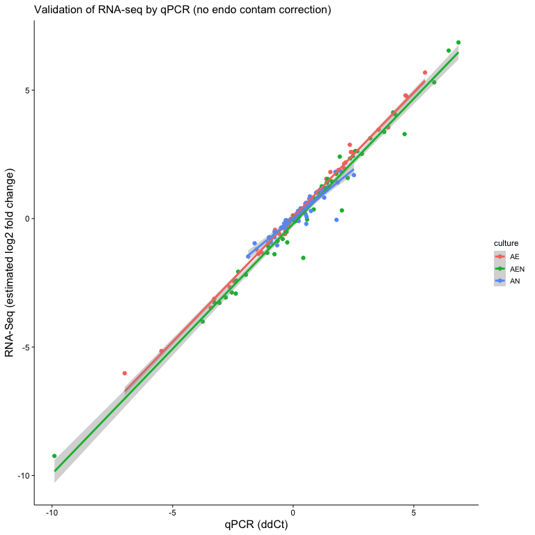

# Raw qPCR Data

Data was filtered for reactions with “Call” == “Pass”. Culture condition
was added to each sample to facilitate downstream analysis.

## Data Points without Corresponding Culture Condition

These are samples that are not among the original sample set that were
used for RNA-seq. Note the inclusion of the blank samples for the target
Srp68. This indicates that the Srp68 primers amplify without template.
Possible primer-dimer amplification. The Srp68 reactions should be
excluded.

    ## # A tibble: 41 × 15
    ##    ID      sample    culture Sample_Type rConc Target Test_Type Ct_Value Quality
    ##    <chr>   <chr>     <chr>   <chr>       <dbl> <chr>  <chr>        <dbl>   <dbl>
    ##  1 S96-A01 No Sample <NA>    Blank           1 Adcy1  Test          27.8   1    
    ##  2 S96-A31 No Sample <NA>    Blank           1 Srp68  Test          18.1   0.767
    ##  3 S95-A31 No Sample <NA>    Blank           1 Srp68  Test          18.1   0.682
    ##  4 S04-A31 No Sample <NA>    Blank           1 Srp68  Test          18.5   0.713
    ##  5 S92-A31 No Sample <NA>    Blank           1 Srp68  Test          18.0   0.839
    ##  6 S91-A31 No Sample <NA>    Blank           1 Srp68  Test          17.8   0.819
    ##  7 S88-A31 No Sample <NA>    Blank           1 Srp68  Test          18.7   0.748
    ##  8 S87-A31 No Sample <NA>    Blank           1 Srp68  Test          18.2   0.699
    ##  9 S08-A31 No Sample <NA>    Blank           1 Srp68  Test          18.4   0.711
    ## 10 S84-A31 No Sample <NA>    Blank           1 Srp68  Test          18.6   0.727
    ## # ℹ 31 more rows
    ## # ℹ 6 more variables: Call <chr>, Threshold <dbl>, `In Range` <dbl>,
    ## #   `Out Range` <dbl>, `Peak Ratio` <dbl>, Comments <lgl>

## Summary of qPCR Data

This table contains the mean values for each culture condition and
target. The key value is ddCt with is equivalent to log2 fold change. It
is ddCt that will be compared to the RNA-seq estimated log2 fold
changes.

    ## # A tibble: 1,216 × 9
    ## # Groups:   sample [21]
    ##    sample Target mean_Ct     sd culture calibrator_Ct delta_Ct mean_con_dCt
    ##    <chr>  <chr>    <dbl>  <dbl> <chr>           <dbl>    <dbl>        <dbl>
    ##  1 AN_G1  Adcy1    13.7  0.0582 AN               11.3   -2.45        -1.56 
    ##  2 AN_G1  Aldoc     6.75 0.0438 AN               11.3    4.55         3.41 
    ##  3 AN_G1  Appl2    10.8  0.134  AN               11.3    0.447       -0.125
    ##  4 AN_G1  Aqp4      7.06 0.0977 AN               11.3    4.24         3.30 
    ##  5 AN_G1  Atp1b1    7.04 0.0680 AN               11.3    4.26         3.82 
    ##  6 AN_G1  Ccnd1     8.47 0.0286 AN               11.3    2.83         3.99 
    ##  7 AN_G1  Ccnd2     8.29 0.0745 AN               11.3    3.01         3.57 
    ##  8 AN_G1  Cdk1     11.9  0.117  AN               11.3   -0.570        0.855
    ##  9 AN_G1  Clcn5    14.4  0.164  AN               11.3   -3.12        -2.30 
    ## 10 AN_G1  Cldn10   12.9  0.138  AN               11.3   -1.64        -3.36 
    ## # ℹ 1,206 more rows
    ## # ℹ 1 more variable: ddCt <dbl>

# Boxplot of A vs. EAN

# Correlation with RNA-seq Data

## AN Fit

    ## 
    ## Call:
    ## lm(formula = mean_ddCt ~ seq_lfc, data = corr_data %>% filter(culture == 
    ##     "AN"))
    ## 
    ## Residuals:
    ##      Min       1Q   Median       3Q      Max 
    ## -0.51175 -0.16423 -0.05963  0.03238  1.78971 
    ## 
    ## Coefficients:
    ##             Estimate Std. Error t value Pr(>|t|)    
    ## (Intercept)  0.05925    0.04592    1.29    0.202    
    ## seq_lfc      1.11003    0.05945   18.67   <2e-16 ***
    ## ---
    ## Signif. codes:  0 '***' 0.001 '**' 0.01 '*' 0.05 '.' 0.1 ' ' 1
    ## 
    ## Residual standard error: 0.3296 on 56 degrees of freedom
    ## Multiple R-squared:  0.8616, Adjusted R-squared:  0.8591 
    ## F-statistic: 348.6 on 1 and 56 DF,  p-value: < 2.2e-16

## EA Fit

    ## 
    ## Call:
    ## lm(formula = mean_ddCt ~ seq_lfc, data = corr_data %>% filter(culture == 
    ##     "AE"))
    ## 
    ## Residuals:
    ##     Min      1Q  Median      3Q     Max 
    ## -7.2250 -0.4718  0.0510  0.6835  3.4501 
    ## 
    ## Coefficients:
    ##             Estimate Std. Error t value Pr(>|t|)    
    ## (Intercept)   0.3543     0.2166   1.636    0.107    
    ## seq_lfc       1.2791     0.1964   6.514 2.19e-08 ***
    ## ---
    ## Signif. codes:  0 '***' 0.001 '**' 0.01 '*' 0.05 '.' 0.1 ' ' 1
    ## 
    ## Residual standard error: 1.649 on 56 degrees of freedom
    ## Multiple R-squared:  0.4311, Adjusted R-squared:  0.4209 
    ## F-statistic: 42.43 on 1 and 56 DF,  p-value: 2.193e-08

## EAN Fit

    ## 
    ## Call:
    ## lm(formula = mean_ddCt ~ seq_lfc, data = corr_data %>% filter(culture == 
    ##     "AEN"))
    ## 
    ## Residuals:
    ##     Min      1Q  Median      3Q     Max 
    ## -3.2054 -0.3782 -0.0664  0.2530  3.0005 
    ## 
    ## Coefficients:
    ##             Estimate Std. Error t value Pr(>|t|)    
    ## (Intercept)  0.34362    0.11060   3.107  0.00297 ** 
    ## seq_lfc      1.08462    0.04659  23.282  < 2e-16 ***
    ## ---
    ## Signif. codes:  0 '***' 0.001 '**' 0.01 '*' 0.05 '.' 0.1 ' ' 1
    ## 
    ## Residual standard error: 0.8358 on 56 degrees of freedom
    ## Multiple R-squared:  0.9064, Adjusted R-squared:  0.9047 
    ## F-statistic:   542 on 1 and 56 DF,  p-value: < 2.2e-16

# Plot of Correlation between RNA-seq and qPCR

## Interactive Plot

## Correlation Data

    ## # A tibble: 174 × 4
    ## # Groups:   culture [3]
    ##    culture Target mean_ddCt seq_lfc
    ##    <chr>   <chr>      <dbl>   <dbl>
    ##  1 AE      Adcy1     -1.52   -0.421
    ##  2 AE      Aldoc      1.88    0.286
    ##  3 AE      Appl2      0.293   0.529
    ##  4 AE      Aqp4       1.43    0.185
    ##  5 AE      Atp1b1    -0.208  -0.350
    ##  6 AE      Ccnd1     -1.31   -1.66 
    ##  7 AE      Ccnd2     -0.154  -0.435
    ##  8 AE      Cdk1      -0.279  -0.264
    ##  9 AE      Clcn5      0.476   0.268
    ## 10 AE      Cldn10     2.10    0.454
    ## # ℹ 164 more rows

# Correlation of RT-qPCR to uncorrected LFC from RNA-seq data

    ## # A tibble: 174 × 3
    ##    Target  culture seq_lfc
    ##    <chr>   <chr>     <dbl>
    ##  1 Slc7a11 AN       0.862 
    ##  2 Slc7a11 AE       5.68  
    ##  3 Slc7a11 AEN      6.86  
    ##  4 Ephb2   AN      -0.365 
    ##  5 Ephb2   AE      -2.44  
    ##  6 Ephb2   AEN     -3.28  
    ##  7 Sema3c  AN      -0.0662
    ##  8 Sema3c  AE      -3.12  
    ##  9 Sema3c  AEN     -3.28  
    ## 10 Slc1a2  AN       1.05  
    ## # ℹ 164 more rows

# Correlation with uncorrected RNA-seq Data

## AN Fit

    ## 
    ## Call:
    ## lm(formula = mean_ddCt ~ seq_lfc, data = uncor_corr_data %>% 
    ##     filter(culture == "AN"))
    ## 
    ## Residuals:
    ##      Min       1Q   Median       3Q      Max 
    ## -0.57507 -0.16617 -0.05160  0.04665  1.79807 
    ## 
    ## Coefficients:
    ##             Estimate Std. Error t value Pr(>|t|)    
    ## (Intercept)  0.05265    0.04669   1.128    0.264    
    ## seq_lfc      1.11889    0.06089  18.374   <2e-16 ***
    ## ---
    ## Signif. codes:  0 '***' 0.001 '**' 0.01 '*' 0.05 '.' 0.1 ' ' 1
    ## 
    ## Residual standard error: 0.3342 on 56 degrees of freedom
    ## Multiple R-squared:  0.8577, Adjusted R-squared:  0.8552 
    ## F-statistic: 337.6 on 1 and 56 DF,  p-value: < 2.2e-16

## EA Fit

    ## 
    ## Call:
    ## lm(formula = mean_ddCt ~ seq_lfc, data = uncor_corr_data %>% 
    ##     filter(culture == "AE"))
    ## 
    ## Residuals:
    ##      Min       1Q   Median       3Q      Max 
    ## -0.77218 -0.05822  0.02721  0.09987  0.37234 
    ## 
    ## Coefficients:
    ##             Estimate Std. Error t value Pr(>|t|)    
    ## (Intercept) -0.05990    0.02485   -2.41   0.0193 *  
    ## seq_lfc      1.02271    0.01166   87.68   <2e-16 ***
    ## ---
    ## Signif. codes:  0 '***' 0.001 '**' 0.01 '*' 0.05 '.' 0.1 ' ' 1
    ## 
    ## Residual standard error: 0.1859 on 56 degrees of freedom
    ## Multiple R-squared:  0.9928, Adjusted R-squared:  0.9926 
    ## F-statistic:  7688 on 1 and 56 DF,  p-value: < 2.2e-16

## EAN Fit

    ## 
    ## Call:
    ## lm(formula = mean_ddCt ~ seq_lfc, data = uncor_corr_data %>% 
    ##     filter(culture == "AEN"))
    ## 
    ## Residuals:
    ##      Min       1Q   Median       3Q      Max 
    ## -0.86008 -0.20248 -0.08165  0.05933  1.73687 
    ## 
    ## Coefficients:
    ##             Estimate Std. Error t value Pr(>|t|)    
    ## (Intercept)  0.21707    0.05683    3.82 0.000337 ***
    ## seq_lfc      1.00193    0.02118   47.30  < 2e-16 ***
    ## ---
    ## Signif. codes:  0 '***' 0.001 '**' 0.01 '*' 0.05 '.' 0.1 ' ' 1
    ## 
    ## Residual standard error: 0.4268 on 56 degrees of freedom
    ## Multiple R-squared:  0.9756, Adjusted R-squared:  0.9751 
    ## F-statistic:  2238 on 1 and 56 DF,  p-value: < 2.2e-16

# Plot of Correlation between RNA-seq and qPCR using uncorrected RNA-seq estimations

# Environment

    ## R version 4.1.3 (2022-03-10)
    ## Platform: x86_64-apple-darwin17.0 (64-bit)
    ## Running under: macOS Big Sur/Monterey 10.16
    ## 
    ## Matrix products: default
    ## BLAS:   /Library/Frameworks/R.framework/Versions/4.1/Resources/lib/libRblas.0.dylib
    ## LAPACK: /Library/Frameworks/R.framework/Versions/4.1/Resources/lib/libRlapack.dylib
    ## 
    ## locale:
    ## [1] en_US.UTF-8/en_US.UTF-8/en_US.UTF-8/C/en_US.UTF-8/en_US.UTF-8
    ## 
    ## attached base packages:
    ## [1] stats     graphics  grDevices utils     datasets  methods   base     
    ## 
    ## other attached packages:
    ## [1] plotly_4.10.1 ggplot2_3.4.2 stringr_1.5.0 tidyr_1.3.0   dplyr_1.1.2  
    ## [6] readxl_1.4.2 
    ## 
    ## loaded via a namespace (and not attached):
    ##  [1] RColorBrewer_1.1-3 highr_0.10         cellranger_1.1.0   pillar_1.9.0      
    ##  [5] compiler_4.1.3     tools_4.1.3        digest_0.6.31      lattice_0.21-8    
    ##  [9] nlme_3.1-162       viridisLite_0.4.1  jsonlite_1.8.4     evaluate_0.20     
    ## [13] lifecycle_1.0.3    tibble_3.2.1       gtable_0.3.3       mgcv_1.8-42       
    ## [17] pkgconfig_2.0.3    rlang_1.1.0        Matrix_1.5-4       cli_3.6.1         
    ## [21] rstudioapi_0.14    crosstalk_1.2.0    yaml_2.3.7         xfun_0.39         
    ## [25] fastmap_1.1.1      withr_2.5.0        httr_1.4.5         knitr_1.42        
    ## [29] generics_0.1.3     vctrs_0.6.2        htmlwidgets_1.6.2  webshot_0.5.4     
    ## [33] grid_4.1.3         tidyselect_1.2.0   glue_1.6.2         data.table_1.14.8 
    ## [37] R6_2.5.1           fansi_1.0.4        rmarkdown_2.21     farver_2.1.1      
    ## [41] purrr_1.0.1        magrittr_2.0.3     ellipsis_0.3.2     splines_4.1.3     
    ## [45] scales_1.2.1       htmltools_0.5.5    colorspace_2.1-0   labeling_0.4.2    
    ## [49] utf8_1.2.3         stringi_1.7.12     lazyeval_0.2.2     munsell_0.5.0
